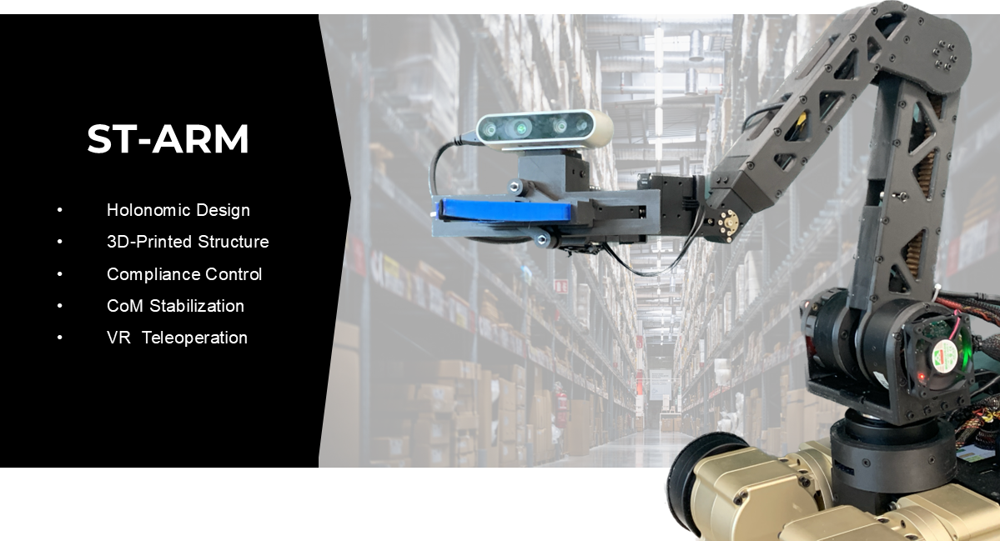

# ST Arm Control Simulation


## Realized Hardware System

**Video Link:** https://www.youtube.com/watch?v=FMRgZ9l8Ioc

This project provides a simplified ROS + Gazebo simulation of the ST Arm, based on the original mobile manipulator research project.

The real ST Arm is a lightweight mobile manipulator designed for telepresence with VR control. Key features include:
- Six degrees of freedom  
- 3D-printed mechanical structure  
- Quasi-Direct Drive (QDD) actuation  
- VR-based teleoperation  

### Motion Control Modules
- **Compliance Control :** Joint-level compliance + task-space control
- **Center-of-Mass (CoM) Stabilization :** For quadruped integration
- **Gravity Compensation :** Stable behavior during interaction
- **VR Headset Control :** Quaternion-based PD mapping


## Installation
### A. Docker Installation (Recommended)
```bash
docker pull ok701/st_arm:noetic
```
Set Gazebo model path:
```bash
export GAZEBO_MODEL_PATH=$GAZEBO_MODEL_PATH:/ws/src
```
### B. Local Installation (if not using Docker)
 Build RBDL manually:
```bash
cd /ws/src/rbdl
mkdir build
cd build
cmake .. -DRBDL_BUILD_ADDON_URDFREADER=ON
make -j8
make install
```
Initialize workspace:
```bash
source /opt/ros/noetic/setup.bash
catkin build
source /ws/devel/setup.bash
```


## 1. RViz Visualization
Visualize the robot and test joint movements using RViz + joint_state_publisher.


<br>

```bash
roslaunch st_arm_description display.launch
```

## 2. Gazebo Simulation

You can simulate different control modes. Currently, try **∞-trajectory tracking** (verified).


<br>

```bash
roslaunch st_arm_gazebo gazebo.launch
```

Run mode 1:
```bash
rostopic pub /st_arm/mode_selector std_msgs/Int32 "data: 1"
```


## Reference  
This research is supported by the "Police Lab 2.0 Project" (Project No. 210121M05), funded by the Ministry of Science and ICT and the National Police Agency.


[Read Paper](https://www.dbpia.co.kr/pdf/pdfView.do?nodeId=NODE11182130&googleIPSandBox=false&mark=0&minRead=5&ipRange=false&b2cLoginYN=false&icstClss=010000&isPDFSizeAllowed=true&accessgl=Y&language=ko_KR&hasTopBanner=true)
